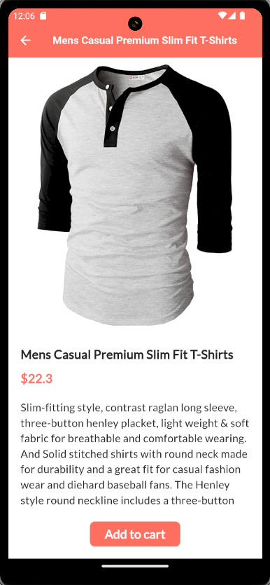

# QuickCart

QuickCart is an e-commerce mobile application that displays products to users from [Fakestore API](https://fakestoreapi.com/product).

## App Screenshots

  

## Features

- Fetches a list of products from an API
- Displays product name, image, and price in a grid view
- Supports both light and dark themes
- Displays detailed information about the selected product, including name, image, price, and description.

## Getting Started

### Prerequisites

- [Flutter](https://flutter.dev/docs/get-started/install) (latest stable version recommended)
- [Dart](https://dart.dev/get-dart) SDK
- A code editor like [Visual Studio Code](https://code.visualstudio.com/) or [Android Studio](https://developer.android.com/studio)

### Installation

1. Clone the repository:

    ```sh
    git clone https://github.com/ogunkapc/QuickCart.git
    cd quickcart
    ```

2. Install dependencies:

    ```sh
    flutter pub get
    ```

### Running the App

1. Connect your device or start an emulator.

2. Run the app:

    ```sh
    flutter run
    ```

## Project Structure

- `lib/`
  - `main.dart`: Entry point of the application.
  - `models/`
    - `product.dart`: Defines the Product and Rating models.
  - `services/`
    - `api_service.dart`: Handles API requests.
  - `screens/`
    - `product_list_screen.dart`: Displays the list of products.
    - `product_detail_screen.dart`: Displays details of a selected product.
  - `constants/`
    - `color_constants.dart`: Contains color constants used in the app

## Dependencies

- [Fake Store API](https://fakestoreapi.com/product) : A REST API for e-commerce or shopping apps and websites prototype.
- [Google Fonts](https://pub.dev/packages/google_fonts) : A third-party library providing custom fonts.

## Download

You can as well download the APK file [here](https://drive.google.com/file/d/1QxT2QAWRHbEhQPtv-I7my96eD7_II_sz/view?usp=sharing) and install the app on an android phone.

## Contributing

Contributions and suggestions are welcome! Fork the repository and submit a pull request. For major changes, please open an issue first to discuss what you would like to change.
